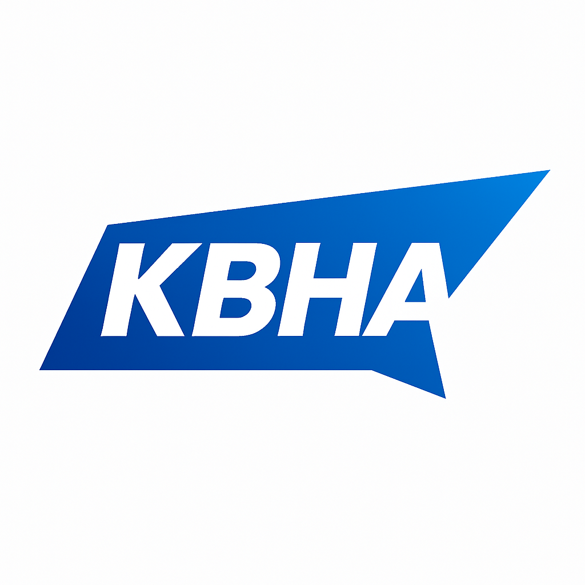
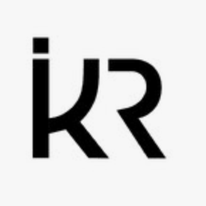
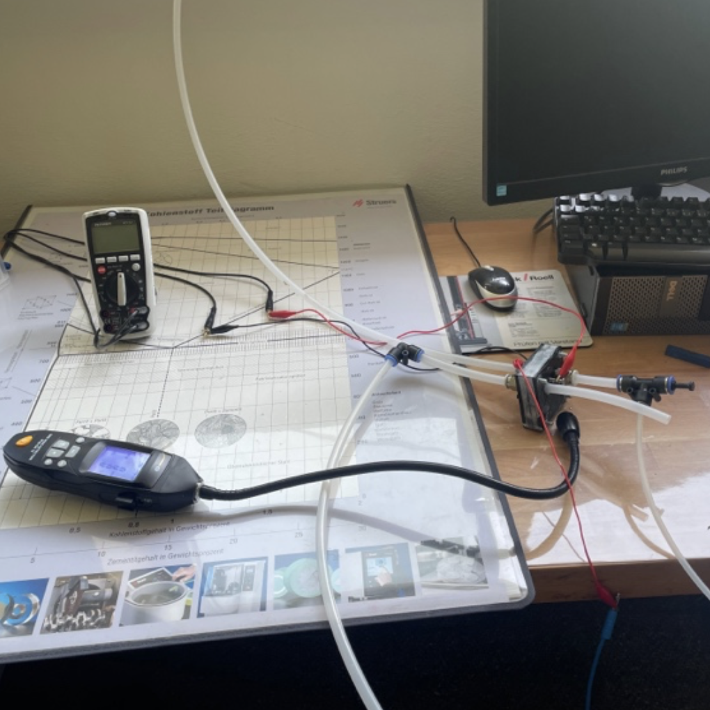
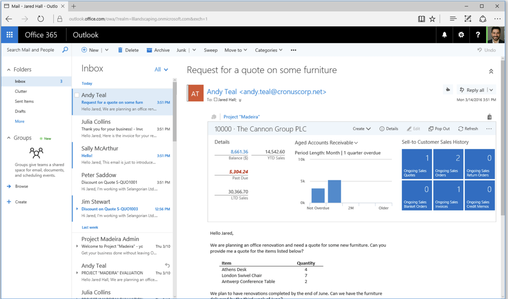
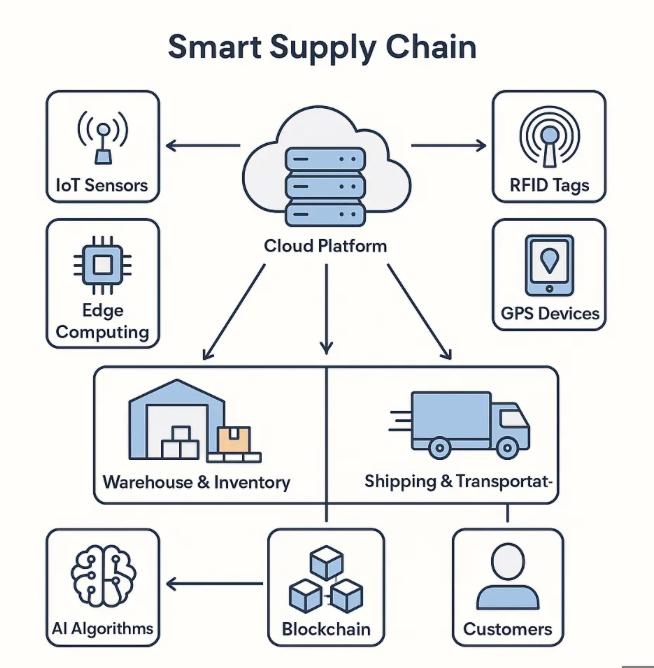
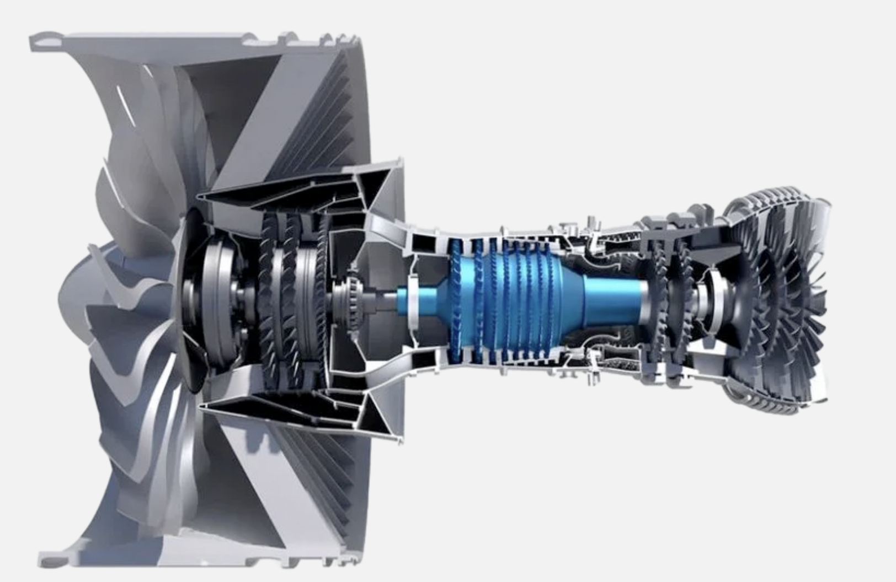

<html lang="de">
<head>
  <meta charset="utf-8" />
  <meta name="viewport" content="width=device-width, initial-scale=1" />
  <title>Karim Bel Hadj Ali – Wirtschaftsingenieur & Projektmanager </title>
  <meta name="description" content="Wirtschaftsingenieur & Projektmanager. Verfügbar ab sofort. Standort: Hannover – deutschland, Frankreich Schweiz & Dubai remote/onsite." />
  <link rel="preconnect" href="https://fonts.googleapis.com">
  <link rel="preconnect" href="https://fonts.gstatic.com" crossorigin>
  <link href="https://fonts.googleapis.com/css2?family=Inter:wght@300;400;500;600;700;800;900&display=swap" rel="stylesheet">
  
  
</head>
<body class="bg-slate-50 text-slate-900">
  <!-- Header -->
  <header class="sticky top-0 z-40 backdrop-blur bg-white/70 border-b border-slate-200/60">
    

      

      <nav class="hidden md:flex items-center gap-6 text-sm font-medium">
        <a href="#leistungen" class="hover:text-blue-600">Leistungen</a>
        <a href="#referenzen" class="hover:text-blue-600">Referenzen</a>
        <a href="#skills" class="hover:text-blue-600">Skills</a>
        <a href="#kontakt" class="hover:text-blue-600">Kontakt</a>
      </nav>
      <a href="#kontakt" class="inline-flex items-center gap-2 px-3 py-2 rounded-xl bg-blue-600 text-white text-sm font-semibold shadow-sm hover:bg-blue-700 focus:outline-none focus:ring-2 focus:ring-blue-400">
        Jetzt anfragen
        <svg xmlns="http://www.w3.org/2000/svg" viewBox="0 0 24 24" fill="currentColor" class="w-4 h-4"><path d="M13.5 4.5h6a.75.75 0 0 1 .75.75v6a.75.75 0 0 1-1.5 0V6.31l-8.72 8.72a.75.75 0 1 1-1.06-1.06l8.72-8.72h-4.94a.75.75 0 0 1 0-1.5Z"/></svg>
      </a>
    

  </header>

  <!-- Hero with consulting background -->
  <section id="top" class="relative overflow-hidden">
    

    

    

      

        

          Verfügbar ab sofort
          <h1 class="text-3xl md:text-5xl font-extrabold leading-tight tracking-tight">Karim Bel Hadj Ali  Wirtschaftsingenieur & Projektmanager </h1>
          
Industrieerfahrung in Software, Batterietechnik und Bau. Fokus auf Projektmanagement (klassisch & agil), Supply Chain, Controlling sowie Vertrags- & Nachtragsmanagement (VOB/HOAI). Deutschland, Frankreich, Schweiz & Dubai – remote oder vor Ort.

          
Teilnahme an 40+ Projekten in verschiedenen Branchen.

          

            <a href="mailto:karim.belhajali@icloud.com" class="inline-flex items-center gap-2 px-4 py-2 rounded-xl bg-slate-900 text-white font-semibold shadow hover:bg-black">
              <svg xmlns="http://www.w3.org/2000/svg" class="w-5 h-5" viewBox="0 0 24 24" fill="currentColor"><path d="M1.5 5.25A2.25 2.25 0 0 1 3.75 3h16.5A2.25 2.25 0 0 1 22.5 5.25v13.5A2.25 2.25 0 0 1 20.25 21H3.75A2.25 2.25 0 0 1 1.5 18.75V5.25Zm2.4.75 7.35 5.145a.75.75 0 0 0 .9 0L19.5 6"/></svg>
              karim.belhajali@icloud.com
            </a>
            <a href="tel:+491728890424" class="inline-flex items-center gap-2 px-4 py-2 rounded-xl border border-slate-300 bg-white font-semibold hover:border-slate-400">
              <svg xmlns="http://www.w3.org/2000/svg" class="w-5 h-5" viewBox="0 0 24 24" fill="currentColor"><path d="M2.25 6.75A4.5 4.5 0 0 1 6.75 2.25h.56c.5 0 .95.3 1.12.76l1.26 3.49a1.25 1.25 0 0 1-.36 1.37L8.2 9.05a12 12 0 0 0 6.75 6.75l1.17-1.12c.37-.35.92-.47 1.37-.36l3.49 1.26c.46.17.76.62.76 1.12v.56a4.5 4.5 0 0 1-4.5 4.5h-.38C8.69 21.76 2.24 15.31 2.24 7.13v-.38Z"/></svg>
              +49 172 8890424
            </a>
            
              <svg xmlns="http://www.w3.org/2000/svg" class="w-5 h-5" viewBox="0 0 24 24" fill="currentColor"><path d="M12 2.25c-4.28 0-7.75 3.47-7.75 7.75 0 5.81 7.75 11.75 7.75 11.75s7.75-5.94 7.75-11.75c0-4.28-3.47-7.75-7.75-7.75Zm0 10.25a2.5 2.5 0 1 1 0-5 2.5 2.5 0 0 1 0 5Z"/></svg>
              Hannover · Stammestraße 48a
            
          

        

        

          <!-- Profile image with white background card -->
          

            
          

        

      

    

  </section>

  <!-- Leistungen -->
  <section id="leistungen" class="py-16 md:py-24">
    

      <h2 class="text-2xl md:text-3xl font-extrabold tracking-tight">Leistungen</h2>
      
Ich übernehme End-to-End Verantwortung von der Anforderungsaufnahme über Ausschreibung/Procurement bis zur Umsetzung und dem Controlling. Transparent, wirksam und skalierbar.

      

        

          <h3 class="font-bold text-lg">Projektmanagement</h3>
          <ul class="mt-3 space-y-2 text-sm text-slate-700 list-disc list-inside">
            <li>PMO, Roadmaps, Sprint-Planung</li>
            <li>Stakeholder- & Ressourcensteuerung</li>
            <li>Qualitätssicherung & Abnahme</li>
          </ul>
        

        

          <h3 class="font-bold text-lg">Supply Chain Management</h3>
          <ul class="mt-3 space-y-2 text-sm text-slate-700 list-disc list-inside">
            <li>Bedarf, Beschaffung, Lieferanten</li>
            <li>Logistik- & Lagerkonzepte</li>
            <li>Prozessmodellierung & KPI</li>
          </ul>
        

        

          <h3 class="font-bold text-lg">Controlling & Verträge</h3>
          <ul class="mt-3 space-y-2 text-sm text-slate-700 list-disc list-inside">
            <li>Budgetierung & Forecasts</li>
            <li>VOB/HOAI, Preisspiegel, Vergabe</li>
            <li>Nachtragsmanagement</li>
          </ul>
        

      

    

  </section>

  <!-- Referenzen / Logos (auto sliding) -->
  <section id="referenzen" class="py-16 md:py-24 bg-white border-y border-slate-200/70">

<h2 class="text-2xl md:text-3xl font-extrabold tracking-tight">Unternehmen & Projekte</h2>

<button id="logosPrev" aria-label="Zurück" class="p-2 rounded-lg border border-slate-200 hover:bg-slate-50">&larr;</button>
<button id="logosNext" aria-label="Weiter" class="p-2 rounded-lg border border-slate-200 hover:bg-slate-50">&rarr;</button>

  

    
    Volkswagen
  

  

    
    Kuhn &amp; Partner
  

  

    
    Excellence AG
  

  

    
    Wissenswerft
  

  
   

    
    Airbus
  

  

    
    Ikaria
  

<!-- Eigene Projekt-Sektion unterhalb der Logos -->

  <!-- Projekt 1: 3D-gedruckte Brennstoffzelle -->
  

    
    <h3 class="font-bold text-lg text-center">3D-gedruckte Brennstoffzelle</h3>
    

      Entwicklung & Erprobung einer <strong>3D-gedruckten Brennstoffzelle</strong>; 
      <strong>Aufhärtung von Kohlenstofffasern</strong> für Leichtbau-Autoteile. 
      <strong>CAD-Konstruktion & Simulation</strong>, Materialtests und Übertragbarkeit auf weitere F&E-Projekte.
    

  

  <!-- Projekt 2: Lean-ERP (Outlook · Excel · Power BI) -->
  

    
    <h3 class="font-bold text-lg text-center">Lean-ERP (Outlook · Excel · Power BI)</h3>
    

      Aufbau eines <strong>leichtgewichtigen ERP-Systems</strong> auf Microsoft-Basis: 
      <strong>Outlook</strong> (Workflows), <strong>Excel</strong> (Stammdaten & Datenmodell), 
      <strong>Power BI</strong> (KPI-Dashboards). Automatisierte Freigaben, Einkauf/Controlling-Schnittstellen & Reporting.
    

  

  <!-- Projekt 3: Smart Supply Chain & Ramp-up -->
  

    
    <h3 class="font-bold text-lg text-center">Smart Supply Chain & Ramp-up</h3>
    

      Planung einer <strong>Smart Supply Chain</strong> (FHT) inkl. <strong>Ramp-up-Management</strong>; 
      <strong>FIFO/LIFO</strong> für Bestands- & Materialflussoptimierung, Takt/Kapazitätsplanung, 
      Lieferanten-Onboarding und KPI-Monitoring (Servicegrad, OTD, WIP).
    

  

<!-- Projekt: Triebwerk Testing -->

  
  <h3 class="font-bold text-lg text-center">Triebwerk Testing</h3>
  

    Planung, Durchführung und Dokumentation von <strong>Prüfstandsläufen</strong> für Komponenten- und Systemtests.
    <strong>Instrumentierung &amp; Messdatenerfassung</strong> (Schwingung, Temperatur, Druck) sowie
    <strong>Leistungsanalyse</strong> und Auswertung von Kennfeldern – gemäß relevanter <strong>Sicherheits- und Qualitätsvorgaben</strong>.
  

<!-- Projekt: Software & App Testing -->

  
  <h3 class="font-bold text-lg text-center">Software &amp; App Testing</h3>
  

    End-to-end <strong>Teststrategie</strong> inkl. Testplänen und -fällen, <strong>manuell &amp; automatisiert</strong>
    (Unit, Integration, UI/E2E). <strong>Device-Matrix</strong> (iOS/Android/Browsers), Bug-Tracking,
    <strong>CI/CD-Gates</strong> und Release-Readiness mit klaren <strong>Testberichten</strong>.
  

<!-- Projekt: Business Beratung -->

  
  <h3 class="font-bold text-lg text-center">Business Beratung</h3>
  

    Von <strong>SWOT</strong> und <strong>Risiko-/Chancenanalyse</strong> bis <strong>Go-to-Market</strong>,
    <strong>Online- &amp; Marktpräsenz</strong>: datenbasierte, <strong>trendkonforme Methoden</strong>
    (Wettbewerbs- &amp; Trendanalysen, Benchmarking) und <strong>KPI/OKR</strong>-gesteuerte Umsetzung
    – auf Wunsch mit <strong>Power&nbsp;BI</strong>-Dashboards.
  

      <!-- schließt: 
 -->
</section>  <!-- schließt: <section id="referenzen" ...> -->

  <!-- Skills -->
  <section id="skills" class="py-16 md:py-24">
    

      <h2 class="text-2xl md:text-3xl font-extrabold tracking-tight">Skills & Tech-Stack</h2>
      

        

          <h3 class="font-bold">Methoden & Domänen</h3>
          <ul class="mt-3 grid grid-cols-2 gap-2 text-sm text-slate-700">
            <li>Scrum</li>
            <li>Kanban</li>
              <li>PMO</li>
            <li>VOB/A</li>
<li>VOB/B</li>
<li>HOAI</li>

            <li>Ausschreibung</li>
           <li>Vergabe</li>
            <li>Budgetierung</li>
            <li>Forecast</li>
            <li>Procurement</li>
            <li>Lieferanten</li>
            <li>Prozessmodellierung</li>
          </ul>
        

        

          <h3 class="font-bold">Tools & Software</h3>
          <ul class="mt-3 grid grid-cols-2 gap-2 text-sm text-slate-700">
            <li>MS Office</li>
            <li>Power BI</li>
            <li>SAP S/4HANA</li>
            <li>iTWO</li> 
            <li>Thinkproject</li>
            <li>BIM</li>
            <li>Jira</li>
            <li>Confluence</li>
            <li>WordPress</li>
            <li> Xcode</li>
            <li>Matlab</li>
            <li> SolidWorks</li>
          </ul>
        

      

      

  <h3 class="font-bold">Sprachen</h3>
  <ul class="mt-2 list-disc list-inside text-sm text-slate-700 space-y-1">
    <li>Deutsch (verhandlungssicher)</li>
    <li>Englisch (fließend)</li>
    <li>Französisch & Arabisch (Muttersprache)</li>
    <li>Russisch & Spanisch (Grundkenntnisse)</li>
  </ul>

  

  <!-- Kontakt -->
  <section id="kontakt" class="py-16 md:py-24 bg-white border-t border-slate-200">
    

      

        

          <h2 class="text-2xl md:text-3xl font-extrabold tracking-tight">Kontakt</h2>
          
Lassen Sie uns Ihr Projekt besprechen. Ich melde mich zeitnah zurück.

          <form class="mt-8 grid grid-cols-1 md:grid-cols-2 gap-4" onsubmit="handleSubmit(event)">
            <input required name="name" placeholder="Ihr Name" class="w-full rounded-xl border border-slate-300 px-4 py-3 focus:outline-none focus:ring-2 focus:ring-blue-400" />
            <input required name="email" type="email" placeholder="Ihre E-Mail" class="w-full rounded-xl border border-slate-300 px-4 py-3 focus:outline-none focus:ring-2 focus:ring-blue-400" />
            <input name="firma" placeholder="Firma (optional)" class="w-full rounded-xl border border-slate-300 px-4 py-3 focus:outline-none focus:ring-2 focus:ring-blue-400 md:col-span-2" />
            <textarea required name="nachricht" placeholder="Kurz Ihr Anliegen" rows="4" class="w-full rounded-xl border border-slate-300 px-4 py-3 focus:outline-none focus:ring-2 focus:ring-blue-400 md:col-span-2"></textarea>
            <button class="inline-flex items-center justify-center gap-2 px-4 py-3 rounded-xl bg-blue-600 text-white font-semibold shadow hover:bg-blue-700 md:col-span-2">Nachricht senden</button>
          </form>
          
Diese Demo sendet keine E-Mails – sie öffnet Ihr E-Mail-Programm mit einer vorgefüllten Nachricht.

        

        <aside class="rounded-2xl border border-slate-200 bg-slate-50 p-6 shadow-sm">
          <h3 class="font-bold">Direktkontakt</h3>
          <ul class="mt-3 text-sm space-y-1 pl-0 list-none">
  <li><strong>E-Mail:</strong> <a class="text-blue-700 underline" href="mailto:karim.belhajali@icloud.com">karim.belhajali@icloud.com</a></li>
  <li><strong>Telefon:</strong> <a class="text-blue-700 underline" href="tel:+491728890424">+49 172 8890424</a></li>
  <li><strong>Adresse:</strong> Stammestraße 48a, 30459 Hannover</li>
  <li><strong>Verfügbarkeit:</strong> ab sofort</li>
</ul>
        
        </aside>
      

    

  </section>

  
  <!-- Chatbot: Tidio -->
  
<!-- === FUN BANNER + MINI GAME === -->
<section id="fun" style="max-width:1250px;margin:40px auto;padding:0 16px;">
  <!-- Banner -->
  

    <h2 style="margin:0;font-size:20px;font-weight:600">
      Wartezeit? Kein Stress! 🎮
 
     Zock’ ne Runde, bis ich antworte 🚀
    </h2>
  

  <!-- Mini-Game -->
  

    <h3 style="margin:0 0 10px;font-size:16px;color:#0083ff">Mini-Game: Runner</h3>
    

      Steuerung: <b>Leertaste</b>/<b>↑</b> oder <b>Klick/Tap</b> ins Spielfeld. <b>P</b> für Pause.
    

    <canvas id="runnerCanvas" width="900" height="200"
      style="width:100%;height:auto;display:block;background:#0e141b;border:2px solid #0059c9;border-radius:10px;touch-action:none"></canvas>

    <!-- On-Screen Controls -->
    

      <button id="btnJump"
        style="padding:10px 16px;border-radius:10px;border:none;
               background:linear-gradient(90deg,#0059c9,#0083ff);
               color:#fff;cursor:pointer;font-weight:600">
        ⬆️ Jump
      </button>
      <button id="btnPause"
        style="padding:10px 16px;border-radius:10px;border:none;
               background:linear-gradient(90deg,#0059c9,#0083ff);
               color:#fff;cursor:pointer;font-weight:600">
        ⏸️ Pause
      </button>
    

  

</section>

<!-- === / FUN BANNER + MINI GAME === -->
<!-- Footer -->
  <footer class="py-10">
    

      
&copy;  Karim Bel Hadj Ali. Alle Rechte vorbehalten.

      

        <a class="hover:text-slate-700" href="#top">Impressum (Platzhalter)</a>
        ·
        <a class="hover:text-slate-700" href="#top">Datenschutz (Platzhalter)</a>
      

    

  </footer>

  

